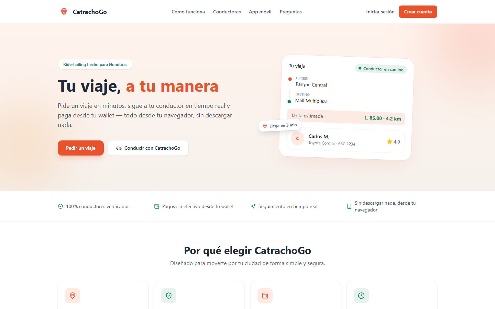
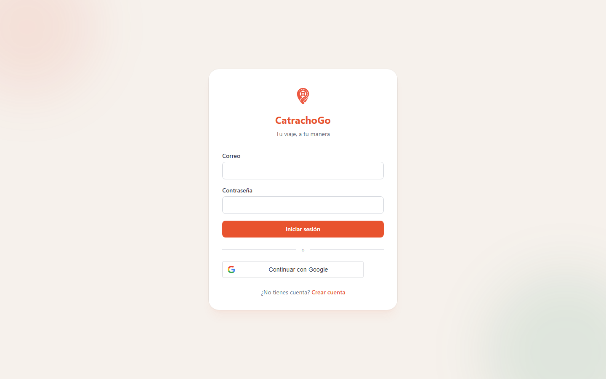
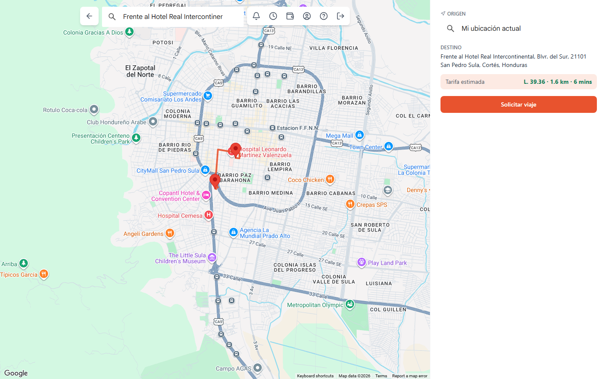
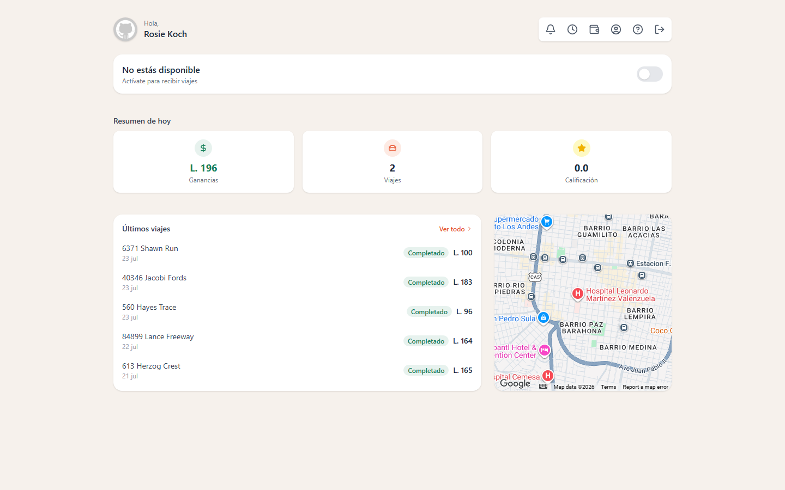
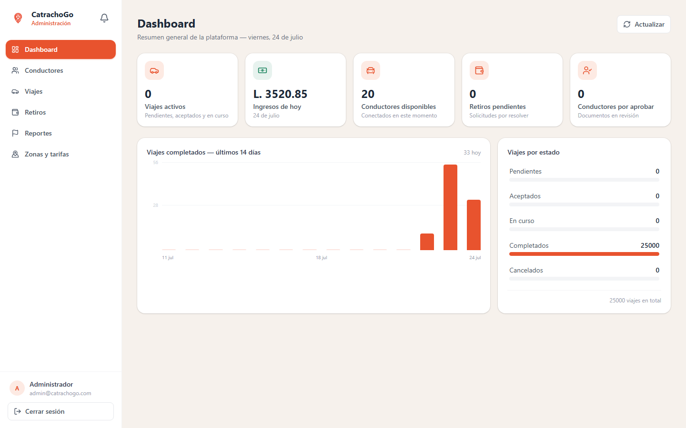

<p align="center">
  
</p>

<p align="center">
  Ride-hailing hecho para Honduras — pide un viaje, conduce y genera ingresos, o administra la plataforma, todo desde el navegador.
</p>

## Qué es CatrachoGo

**CatrachoGo** es el frontend web de una plataforma de ride-hailing (tipo Uber/InDriver) pensada para Honduras. Cubre los tres roles de la plataforma pasajero, conductor y administrador con autenticación por contraseña o Google, wallet con recargas por PayPal, seguimiento de viajes en tiempo real sobre Google Maps, y un panel de administración con dashboard, gestión de conductores, viajes, retiros, zonas tarifarias y reportes de incidencias.

En pantallas de escritorio, las vistas de pasajero y conductor usan un layout de aplicación web real (panel de información junto al mapa, listas tipo tabla) en vez de una app móvil estirada; por debajo del breakpoint de escritorio el diseño mobile se mantiene sin cambios.

Este repositorio consume la API de [`catrachogo-api`](https://github.com/xEdwardP/catrachogo-api) (NestJS + PostgreSQL/PostGIS) — no la modifica. Ambos proyectos corren en paralelo en desarrollo.

Proyecto académico del equipo "Los Inges".

## Funcionalidades

**Pasajero**
- Solicitar viaje con autocompletado de direcciones (Google Places), tarifa estimada antes de confirmar, y ruta trazada sobre el mapa.
- Direcciones favoritas (casa, trabajo, otro) y destinos recientes, disponibles desde la pantalla de inicio.
- Seguimiento del viaje en curso con la ubicación del conductor y datos de contacto una vez aceptado.
- Terminar un viaje antes de llegar al destino, con tarifa recalculada de forma prorrateada.
- Cancelar un viaje (con confirmación y motivo) tanto en espera de conductor como ya con conductor asignado.
- Reportar un problema o a un conductor específico desde el historial o el viaje activo.
- Calificar al conductor al finalizar el viaje.
- Wallet con recarga vía PayPal e historial de movimientos traducido.
- Perfil editable (nombre, teléfono, foto) y sección de ayuda/soporte con FAQ.
- Notificaciones dentro de la app para eventos del viaje (aceptado, iniciado, completado o cancelado).

**Conductor**
- Activarse/desactivarse para recibir viajes (bloqueado hasta que el administrador aprueba sus documentos), estado que se mantiene sincronizado con el backend al navegar entre pantallas.
- Recibir y responder solicitudes entrantes con ventana de tiempo límite.
- Marcar llegada al punto de recogida y cancelar por no-show del pasajero tras un periodo de gracia, con cargo aplicado al pasajero.
- Wallet de solo ganancias/retiros (sin opción de recarga, exclusiva de pasajeros) y solicitud de retiro vía PayPal.
- Mismo perfil, soporte y reporte de incidencias que el pasajero, más notificaciones cuando se resuelve un retiro o cambia su estado de verificación.

**Administración**
- Dashboard con KPIs de la plataforma (viajes activos, ingresos del día, conductores disponibles, retiros y conductores pendientes) y gráfico de viajes completados por día, calculados en el backend con un único endpoint agregado.
- Gestión de conductores (aprobación/rechazo de documentos), viajes, zonas tarifarias, retiros y reportes de incidencias enviados por pasajeros — retiros y reportes cuentan con una vista modal de detalle antes de resolverlos.
- Centro de notificaciones propio en el panel.

**Legal**
- Páginas de Términos de uso, Política de privacidad y Licencias, enlazadas desde el footer y la sección de soporte.

## Stack técnico

- **React 19 + Vite + TypeScript**
- **Tailwind CSS v4**
- **React Router v7**
- **`@vis.gl/react-google-maps`** — mapa, autocompletado de direcciones (Places API) y geocoding
- **`@paypal/react-paypal-js`** — recargas de wallet
- **`@react-oauth/google`** — inicio de sesión con Google
- **Cloudinary** (unsigned upload) — fotos de perfil y documentos de conductor
- **`axios`** — cliente HTTP centralizado
- **`sonner`** — notificaciones/errores de negocio
- **`lucide-react`** — íconos

## Capturas de pantalla

| Landing page | Inicio de sesión |
|---|---|
|  |  |

| Pasajero — solicitar viaje (escritorio) | Conductor — panel principal (escritorio) |
|---|---|
|  |  |

| Administración — dashboard |
|---|
|  |

## Requisitos previos

- **Node.js 20+**
- [`catrachogo-api`](https://github.com/xEdwardP/catrachogo-api) corriendo en paralelo (por defecto en `http://localhost:3000`) — este frontend no funciona sin la API activa.
- Cuentas/API keys propias para: Google Cloud (Maps + Sign-In), PayPal (sandbox), Cloudinary (unsigned upload preset).

## Instalación

```bash
git clone https://github.com/xEdwardP/catrachogo-web.git
cd catrachogo-web
npm install
cp .env.example .env
```

Completa `.env` con tus propias credenciales:

| Variable | De dónde se obtiene |
|---|---|
| `VITE_API_URL` | URL donde corre `catrachogo-api` (`http://localhost:3000` en local) |
| `VITE_GOOGLE_MAPS_API_KEY` | Google Cloud Console → Maps JavaScript API + Places API (New) |
| `VITE_GOOGLE_CLIENT_ID` | Google Cloud Console → Google Identity Services (OAuth Client ID) |
| `VITE_CLOUDINARY_CLOUD_NAME` | Panel de Cloudinary → nombre de tu cloud |
| `VITE_CLOUDINARY_UPLOAD_PRESET` | Cloudinary → Settings → Upload → un preset *unsigned* |
| `VITE_PAYPAL_CLIENT_ID` | PayPal Developer Dashboard → app sandbox |
| `VITE_SUPPORT_EMAIL` | Correo de contacto que se muestra en la sección de soporte |

## Desarrollo

```bash
npm run dev
```

Abre `http://localhost:5173`. Requiere `catrachogo-api` corriendo (ver su propio README para instrucciones).

## Build de producción

```bash
npm run build    # tsc -b && vite build → genera dist/
npm run preview  # sirve el build localmente para probarlo
```

Otros comandos útiles: `npm run lint`.

## Estructura de carpetas

```
src/
├── api/          # cliente HTTP y funciones por dominio (trips, drivers, wallet, admin...)
├── components/   # componentes reutilizables (layouts, inputs, modales)
├── context/      # AuthProvider y contexto de sesión
├── hooks/        # hooks compartidos (polling, posición suavizada del mapa...)
├── pages/        # una pantalla por archivo, organizadas por flujo (pasajero/conductor/admin)
├── types/        # tipos compartidos entre api/ y pages/
└── utils/        # helpers (rutas por rol, etc.)
docs/             # contexto del proyecto para desarrollo asistido (no se sube al build)
```

## Repositorios relacionados

- [`catrachogo-api`](https://github.com/xEdwardP/catrachogo-api) — backend NestJS + PostgreSQL/PostGIS. Es requisito para correr este frontend.
- [`catrachogo-mobile`](https://github.com/xEdwardP/catrachogo-mobile) — app nativa (React Native + Expo) para los tres roles, contra el mismo backend.

## Créditos

Desarrollado por **Edward Pineda** ([@xEdwardP](https://github.com/xEdwardP))
